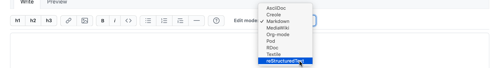

=============================================
Discover basic formatting in reStructuredText
=============================================

If you're familiar with MarkDown, you already know the very basics of rST.

Create a sandbox page in the GitHub wiki
========================================

You can experiment with rST in the GitHub Wiki. It's not a complete reStructuredText implementation, but it's enough to get started with.

`Create a new page there for youself
<https://github.com/evildmp/sphinx-rst/wiki/_new>`_.

Then, set the *Edit mode* to *reStructuredText*:

Add reStructuredText content
============================

Now you can build a page for yourself; add some text, and hit **Preview** to
see the result.

Use the following markup in your page.

Structure
---------

::

    ==========
    Page title
    ==========

    Heading
    =======

    Sub-heading
    -----------

    Sub-sub-heading
    ~~~~~~~~~~~~~~~

    Sub-sub-sub-heading
    ^^^^^^^^^^^^^^^^^^^

    Sub-sub-sub-sub-heading
    .......................

    Sub-sub-sub-sub-sub-heading
    '''''''''''''''''''''''''''

    Ordinary paragraph text. Lorem ipsum dolor sit amet, consectetur adipiscing
    elit. Maecenas tempus, dui in pharetra luctus, turpis nisl rhoncus tellus,
    vitae gravida nibh odio nec diam. Fusce non mi ut odio accumsan ultricies ut
    nec nulla. Phasellus nec odio sit amet neque dignissim tempor eget non ex.
    Aliquam sed lacinia lectus, eu congue est. Ut ac dignissim risus.

Horizontal line
---------------

::

    --------

Inline markup
-------------

::

    *emphasis*

    **strong emphasis**

    ``literal``

Lists
-----

Note how nested items are indented to line up with their parents::

    * item
    * item

      * nested item
      * nested item

    * item

    #. numbered item
    #. numbered item

       #. nested numbered item
       #. nested numbered item

    #. numbered item

Code-blocks
-----------

A simple example of a code-block::

    ::

        @aperture.setter
        def aperture(self, value):
            if value == "A":
                self.exposure_control_system.mode = "Shutter priority"

            elif not 1.7 <= value <= 16:
                raise self.ApertureOutOfRange

            else:
                self.exposure_control_system.mode = "Manual"
                self.exposure_control_system.aperture_set_lever.aperture = value

            self._aperture = value

Notes and admonitions
---------------------

Note that in the GitHub wiki, these are not well-formatted - real Sphinx
documentation does a better job.

::

    .. note::

       Please turn the lights off if you are the last to leave.

       As well as ``note``, you can use ``attention``, ``caution``, ``danger``,
       ``error``, ``hint``, ``important``, ``tip``, ``warning``, ``seealso``.

::

    .. admonition:: Security notice

       The generic ``admonition`` directive allows you to provide a title, as
       above.

Tables
------

There are multiple ways of building tables in rST, the simplest is the list
table::

    .. list-table::
       :widths: 20 20 30
       :header-rows: 1

       * - Web framework
         - Language
         - First release
       * - Django
         - Python
         - July 2005
       * - Ruby on Rails
         - Ruby
         - August 2004
       * - Laravel
         - PHP
         - June 2011

Links
-----

A basic, "dumb" link to an external resource::

    `This is an example <https://example.com>`_

reStructuredText provides much more powerful internal and external linking, but
this is not available in the GitHub wiki, only as part of a real Sphinx
documentation set.
