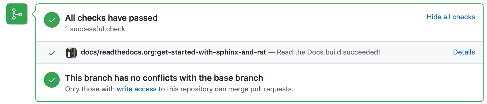

===========
Edit a file
===========

Each page of the published documentation on Read The Docs is maintained in a
file in the GitHub repository for the documentation set.

The :doc:`Register page <register>` that contains a list of all the people who
have done this tutorial is one of those.

In the following steps you will add yourself to that page, by editing the
reStructuredText source file.

.. _make-propose-changes:

Make and propose changes in a file
==================================

#. Open https://github.com/evildmp/sphinx-rst/blob/master/register.rst.
#. Select the **Edit** icon to *Fork this project and edit the file* (if you
   don't see it, you're not logged in):

   .. image:: images/edit-file.png
      :alt: Fork this project and edit this file

#. Select *Create a new branch for this commit and start a pull request*.
#. Add a new entry at the bottom of the list containing the date and a link to
   your GitHub username (and optionally your own name). Follow the pattern of
   existing entries::

       * YYYY-MM-DD `username <https://github.com/username>`_ Your Name

   (Note the underscore at the end of the hyperlink markup.)

#. Make sure the file ends with a blank line.
#. Select the **Propose changes** button.

This will create a fork of the documentation repository in your own GitHub
account.

Make a pull request
===================

The next step is to create a pull request - a request to the maintainers to pull
the changes from the branch you've just created: select **Create pull request**.

As soon as you create the pull request, Read The Docs will start rebuilding the
site. In a few seconds, the build should be complete. Select *Build details* to see the version of the documentation that has just been built for you.

Check that your changes in the *Register* page of your build look correct.

You can also see the `full list of recent builds
<https://readthedocs.org/projects/get-started-with-sphinx-and-rst/builds/>`_.

Read The Docs will show any build errors - if this happens; you'll have to
check your changes and edit the file again.

I will then need to merge your pull request into the repository - it
requires my approval.

Once it has been merged, your changes will become part of the source code of this
website. The newly-updated :doc:`Register page <register>` will contain your
entry.

What's next
===========

This is all you need in order to contribute to documentation that's maintained
in Git, written in reStructuredText, published using Sphinx and hosted on Read
the Docs.

It's good enough for lightweight maintenance and small fixes. For more
substantial documentation contributions, it's much more effective to work
locally - writing, building and testing the documentation - then to push work
to the Git repository.

The next section covers the elements of that workflow, step-by-step.
